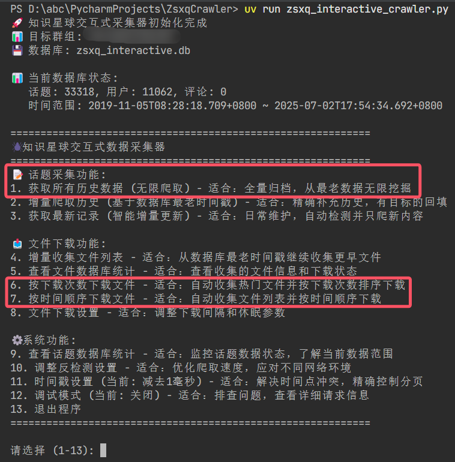

<div align="center">
  
  <h1>🌟 知识星球数据采集器</h1>
  <p>知识星球内容爬取与文件下载工具，支持话题采集、评论获取、文件批量下载等功能</p>
  
  [](https://www.python.org/downloads/)
  [](LICENSE)
  []()
  
  
</div>

## ✨ 项目特性


- 🎯 **智能采集**: 支持全量、增量、智能更新等多种采集模式
- 📁 **文件管理**: 自动下载和管理知识星球中的文件资源
- 💻 **命令行界面**: 提供强大的交互式命令行工具
- 📊 **数据存储**: 完整的SQLite数据库存储
- 🔧 **易部署**: 轻量级部署，无需复杂配置

## 📦 安装部署

### 快速安装

```bash
# 1. 克隆项目
git clone https://github.com/2977094657/ZsxqCrawler.git
cd KnowledgePlanetb

# 2. 安装uv包管理器（推荐）
pip install uv

# 3. 安装依赖
uv sync
```

## 🚀 快速开始

### 1. 获取认证信息

在使用工具前，需要获取知识星球的Cookie和群组ID：

1. **获取Cookie**:
   - 使用浏览器登录知识星球
   - 按 `F12` 打开开发者工具
   - 切换到 `Network` 标签
   - 刷新页面，找到任意API请求
   - 复制请求头中的 `Cookie` 值

2. **获取群组ID**:
   - 访问目标知识星球页面
   - URL格式：`https://wx.zsxq.com/group/{群组ID}`
   - 从URL中提取群组ID

3. **首次使用**：编辑 `config.toml` 文件，填入您的配置信息

### 2. 运行应用

```bash
# 运行交互式命令行工具
uv run zsxq_interactive_crawler.py
```

#### 📝 主要功能

**话题采集功能**:
- **全量采集**: 获取所有历史话题数据
- **增量采集**: 指定页数进行历史数据采集
- **智能更新**: 只采集最新的话题内容
- **无限爬取**: 持续采集直到没有新数据

**文件下载功能**:
- **按下载次数下载**: 下载热门文件
- **按时间顺序下载**: 按发布时间下载文件
- **文件信息收集**: 收集文件列表到数据库
- **统计查看**: 查看数据库中的文件统计信息

## 🤝 贡献指南

欢迎提交Issue和Pull Request！

## 📄 许可证

本项目采用 [MIT License](LICENSE) 开源协议。

## ⚠️ 免责声明

本工具仅供学习和研究使用，请遵守知识星球的服务条款和相关法律法规。使用本工具产生的任何后果由使用者自行承担。

---

<div align="center">
  <p>如果这个项目对你有帮助，请给个 ⭐ Star 支持一下！</p>
</div>